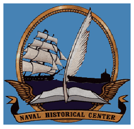

# An International City at Sea
With the opening of Operation Iraqi Freedom (OIF) in 2003 and the
subsequent debate in the United States about the coalition of the willing,
a group of historians at the Naval Historical Center (now the Naval History
and Heritage Command) 
joined the discussion by reflecting on the nature
of effective coalitions. As head of the Contemporary History Branch during
the opening phases of OIF, I asked the historians to consider recent coalitions
engaging in combined naval operations. Under what circumstances did various
national command authorities adopt a combined solution to an external threat
rather than acting alone? What did these international coalitions look like?
What assets and talents did the combined force need? Did efforts of this sort
in the recent past work effectively given the mission? What critical factors
contributed to the success or failure of the combined effort?
We soon realized that historical analysis, approaching problems as it
does from the humanities perspective, could address these questions in an
informative, unique, and stimulating way. Thus the growing public debate
presented us with an unexpected opportunity to apply history directly
to immediate naval needs in an age defined, in part, by 11 September
2001. In the end, the subject matter, the ongoing public debate, and the
opportunity to apply historical methodology proved too compelling to
remain as an informal discussion of combined operations.
Although initially conceived as an American project, it seemed
counterproductive not to seek out other naval history programs offcially
pressed and intellectually stimulated by the same issues and possibilities.
I asked a good friend, Michael Whitby of the Directorate of History and
Heritage (DHH) in Ottawa, to reffect on the possible profit in informing
the present by evaluating naval coalition experiences of the recent past.
Together, we and other colleagues might examine a few select combined
operations as case studies. Did he think my scheme worthwhile given
the current interests of his navy and, perhaps more important, would the
proposal interest his director, Dr. Serge Bernier?
I laid before him a plan to initiate a project involving four national
navies, frequent allies, to examine historically the nature of naval combined 
operations. The project would endeavor to derive conclusions and lessons
that serving naval oficers might find immediately useful in their efforts to
address their missions in the Near East. My plans called for participation
by Canada, the United Kingdom, Australia, and the United States.
Dr. Bernier emerged from his discussion with Michael and DHH Senior
Historian Dr. Steven Harris convinced that the proposal had merit. He assigned
one of his more capable people, Robert Caldwell, as the Canadian member of the
team. With the credibility provided by Dr. Bernier’s generosity and willingness
to take a measured risk, I recruited the balance of the team in 2003: Stephen
Prince, who came to us courtesy of Captain Christopher Page, RN (Ret.),
then the director of the Royal Navy’s Naval Historical Branch in Portsmouth,
United Kingdom; Dr. David Stevens of the Royal Australian Navy’s Sea
Power Centre in Canberra; and Drs. Jeffrey Barlow and Randy Papadopoulos
from the Naval History and Heritage Command, Washington, D.C.
Dr. Bernier’s faith also helped me achieve two important goals. I
convinced then Director of Naval History Dr. William Dudley of the
viability and value of the applied history project we proposed. With his help
we made a successful application to the Naval Historical Foundation for a
grant that sustained this effort and made the collaboration possible. Retired
Vice Admiral Robert Dunn, president of the foundation, and his executive
director, Captain Charles Todd Creekman, USN (Ret.), smoothed our way
and contributed substantively to the positive outcome of the project.
An inaugural team meeting in 2004 hosted by DHH on a cold winter
day in Ottawa determined the best and most evocative cases for study.
Within the 1991–2003 timeframe, our historians would look at maritime
interception operations in the 1990–1991 Gulf War and in Operation
Enduring Freedom, 2001–2003; Operation Stabilise, the United Nationsmandated action to bring peace to East Timor in 1999; and Operation
Sharp Guard in ethnically torn Yugoslavia through 1996.
We designed this study to remind policymakers, strategists, and
operators living in a 21st-century coalition world of the very human
nature of combined operations. While technology enables naval action,
combined operations emerge from these pages as a human endeavor,
based upon personal and professional relationships formed and reformed
by sailors of all ranks across national and cultural boundaries. 

